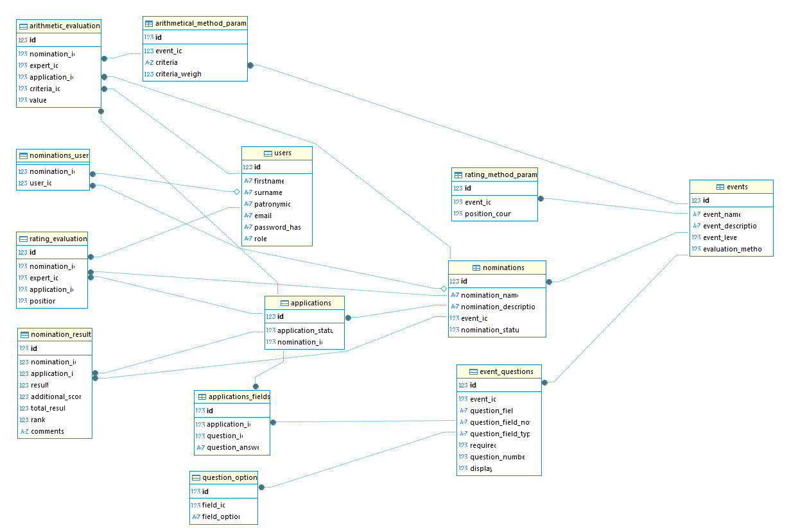

# Voty Main

## Описание проекта

**Voty** — это платформа для организации и проведения конкурсных мероприятий с системой создания мероприятий и номинаций, оценки участников экспертами и автоматического подсчёта результатов. Приложение поддерживает различные методы оценивания, а также формирование итоговых протоколов и ведение базы пользователей и экспертов.

Функционал проекта включает:
- Регистрация и авторизация пользователей (организаторов, экспертов)
- Создание и управление мероприятиями и номинациями
- Экспорт зарегестрированных участников из Excel
- Назначение экспертов на номинации
- Оценивание участников несколькими методами (арифметический, рейтинговый)
- Автоматический подсчёт результатов и формирование протокола в формате docx

## Содержание

- [Описание проекта](#описание-проекта)
- [Содержание](#содержание)
- [Установка](#установка)
- [Запуск](#запуск)
- [Структура проекта](#структура-проекта)
- [API эндпоинты](#api-эндпоинты)
- [Схема Базы данных](#схема-базы-данных)

## Установка

### Backend

1. Клонируйте репозиторий:
   ```sh
   git clone https://github.com/Reape4er/voty-main.git
   ```
2. Перейдите в директорию backend:
   ```sh
   cd voty-main/backend
   ```
3. Установите зависимости:
   ```sh
   pip install -r requirements.txt
   ```
4. Проверьте наличие файла базы данных `database.sqlite3` (создаётся автоматически при первом запуске).

### Frontend

1. Перейдите в директорию фронтенда (например, `Voty`):
   ```sh
   cd ../Voty
   ```
2. Установите зависимости:
   ```sh
   npm install
   ```

## Запуск

### Backend

1. Запустите приложение Flask:
   ```sh
   python app.py
   ```
2. Приложение будет доступно по адресу [http://localhost:5000](http://localhost:5000).

### Frontend

1. Перейдите в директорию фронта (`Voty`):
   ```sh
   cd ../Voty
   ```
2. Запустите приложение:
   ```sh
   npm start
   ```

3. Фронтенд будет доступен по адресу [http://localhost:3000](http://localhost:3000).

## Структура проекта

- `backend/app.py` — основной файл запуска Flask-приложения
- `backend/models.py` — модели базы данных (SQLAlchemy)
- `backend/routes/` — директория с роутами API (`auth.py`, `events.py`, `nominations.py`, и др.)
- `backend/utils.py` — вспомогательные функции для подсчёта результатов и обработки данных
- `backend/static/` — шаблоны документов и статические файлы
- `backend/requirements.txt` — зависимости проекта

- `assets/` — дополнительные материалы(схема бд)

## API эндпоинты

- `/register` — регистрация пользователя
- `/login` — получение JWT токена
- `/events` — CRUD для мероприятий
- `/events/<event_id>/nominations` — управление номинациями
- `/applications` — загрузка и получение заявок
- `/scores` — выставление и получение оценок
- `/result` — подсчёт и получение результатов
- `/get_protocol` — генерация итогового протокола

Подробности по каждому эндпоинту смотрите в соответствующих файлах `backend/routes/`.

## Схема Базы данных


В проекте используется база данных, построенная на SQLAlchemy, с моделями для управления пользователями, мероприятиями, номинациями, анкетами и оценками. Основные сущности включают:

- **Users** — таблица пользователей, поддерживает роли (организатор, эксперт), хранит хэшированные пароли, связан с оценками и номинациями через связи многие-ко-многим.
- **Events** — мероприятия с описанием, уровнем, методом оценивания и связями с вопросами, номинациями и параметрами оценки.
- **EventQuestions** — вопросы анкеты мероприятия, связанные с вариантами ответа и полями заявок.
- **Nominations** — номинации внутри мероприятия, имеют статус, описание, связаны с заявками, экспертами и результатами.
- **Applications** — заявки на участие в номинациях, включают поля анкеты и результаты оценок.
- **ApplicationsFields** — значения конкретных полей анкеты для каждой заявки.
- **ArithmeticalMethodParams** и **RatingMethodParams** — параметры методов оценивания (арифметического и рейтингового), хранят критерии и позиции.
- **ArithmeticEvaluations** и **RatingEvaluations** — результаты оценивания заявок экспертами по номинациям и критериям.
- **NominationResults** — агрегированные результаты и ранжирование заявок по номинациям.
---


